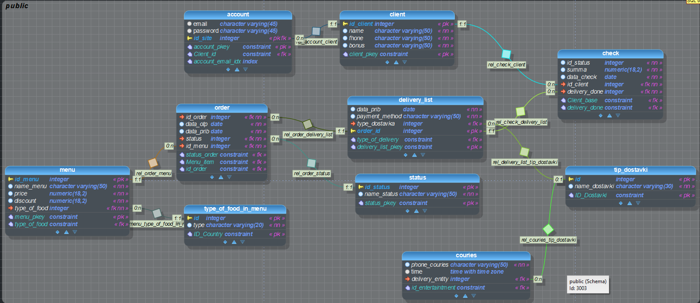

# Управление данными

Группа: ИСТ-20-1б
Выполнил: Катаев Вячеслав
Тема: Доставка еды

## Задание
- Сформулировать задачи сервиса,
- Спроектировать модель данных не менее 10 таблиц,
- Заполнить тестовыми данными,
- Написать не менее 15 запросов в их числе обязательно должны быть агрегации и использование оконных функций.

## Диаграмма


## Запуск и получение данных
- Первым делом нужно запустить файл ```db_dump.sql``` для создания схемы с селектами, которые описаны в представлениях выше
- Затем следует запустить файл ```inserts.sql``` для наполнения схемы данными

Все 15 запросов находятся в файле ```scripts.sql``` вместе с комментариями